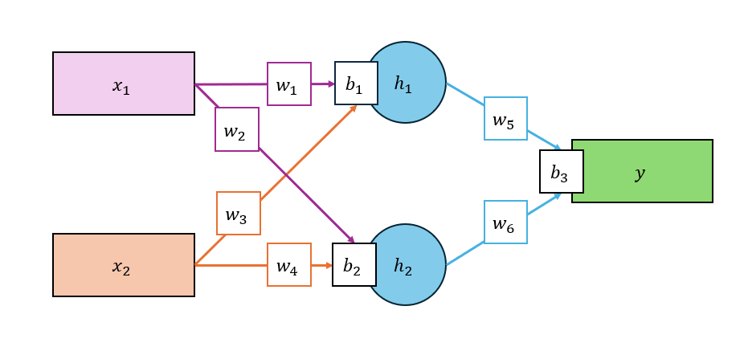

# ANN Using Rust Candle

This project is for fun in 300%, If you come to find useful stuff, probably get nothing.

# Model



# Training Result

```bash
...
Epoch: 993 Train loss: 2855.336426
Epoch: 994 Train loss: 2854.985107
Epoch: 995 Train loss: 2854.634521
Epoch: 996 Train loss: 2854.284668
Epoch: 997 Train loss: 2853.936279
Epoch: 998 Train loss: 2853.588379
Epoch: 999 Train loss: 2853.241699
Epoch: 1000 Train loss: 2852.895996
```

# Output

```text
x: [1, 3] -> (y_true: 13, y_pred: 4)
```
